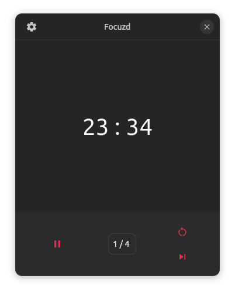
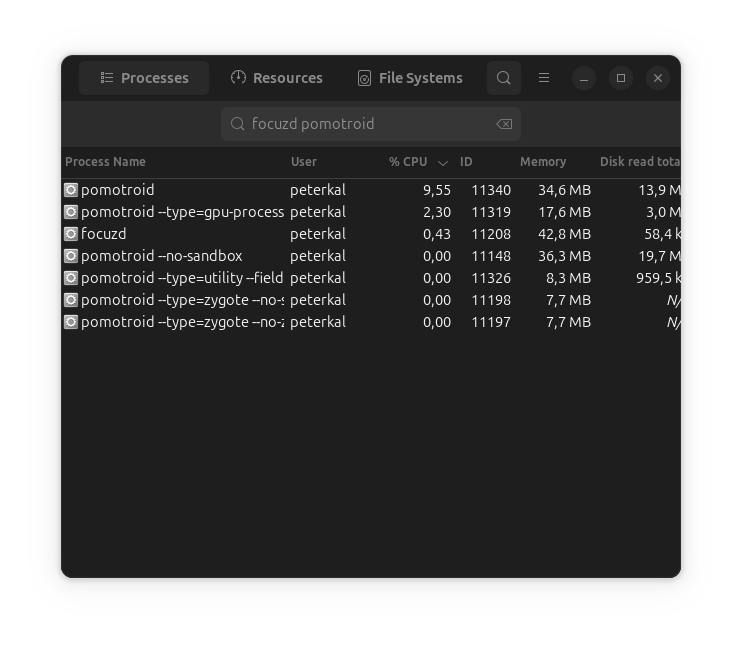

# focuzd

## Dark Mode

## Light Mode

A new pomodoro app, built with Flutter, the goal is to make a feature-equivalent to Pomotroid. Pomotroid uses electron, which makes it pretty heavy, slow to start, and resource intensive. Flutter will solve these issues while also looking nice, and later more features as well as more platforms will be added. 

#### Pomotroid / Focuzd comparison

1) CPU Usage:
   Due to Flutter apps being natively compiled in machine code, the performance of Focuzd 
   far exceeds that of Pomotroid, which is based on Electron, so every time you use it, 
   it's like opening a chromium tab.
   Testing on my device, with the countdown on, the CPU Usage was the following:
- _Focuzd_: **0.43%**
- _Pomotroid_: **9.59**

  

2) Download Size (Snap Store Data):
- _Focuzd_: **12.42 MB**

- _Pomotroid_: **67.08 MB**
3) architecture availability
   _focuzd_ : arm64, amd64
   _pomotroid_: amd64 _only_

4) Update Status: 
   Pomotroid hasn't seen any update since 9 February of 2021  

### For release 1.0

- [x] Feature equivelant to pomotroid
  - [x] start pomodoro sessions
  - [x] show time remaining 
  - [x] show how many sessions you have done in this round 
  - [x] go to the next session
  - [x] reset the session 
  - [x] skip the session

    - [x] change the time lentgh of focus time 
    - [x] change the time lentgh of break 
    - [x] change the time lentgh of long break
    - [x] change the number of rounds
    
    
    
    - [x] have desktop notifications
    - [x] autostart work timer 
    - [x] autostart break timer 
    - [x] memorise the setting's changes
    - [x] make the window be always on top(opt in) 
    - [x] reset changes to default

- [x] publish to snapstore
  
  - [x] snap the app(unfortunately in core22 for now)
  - [x] publish the edge-beta
  - [x] publish in stable                                                                       

- [x] solve the bloc-db problem

- [x] revamp settings page to be more user-friendly 

- [x] fix issue, Next() not working properly when not skipping
  
  ### for release 1.1 minor release
  
  - [ ] make sounds when changing state(opt-in)
  
  - [ ] consider different widgets for settings
  
  - [ ] add greek language support
  
  - [ ] consider adding a circular progress indicator along with the countdown
  
  - [ ] display finish time
  
  

### for release 2.0(still thinking)

- [ ] add statistics and analytics
