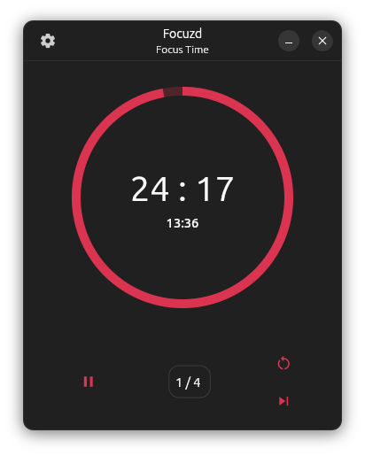
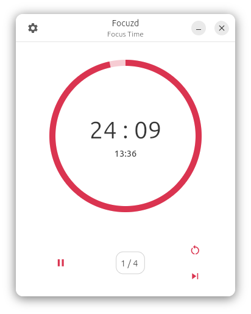
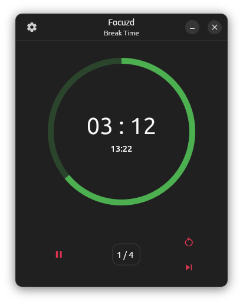
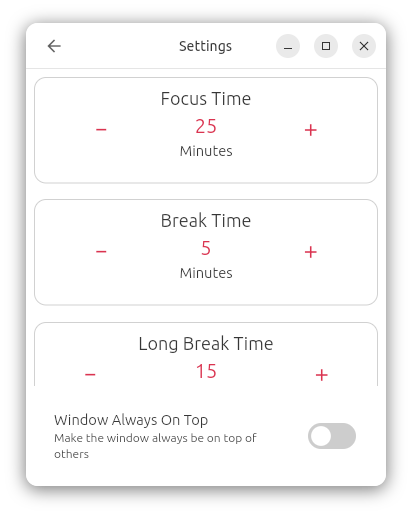
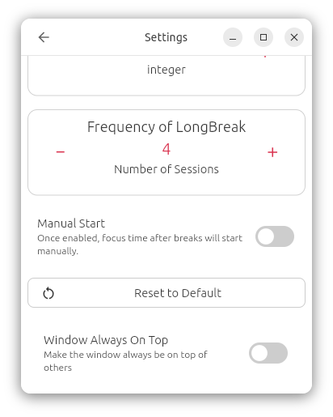

# focuzd

Focuzd is a pomodoro app built for Linux, with Flutter using the Yaru theme. 

- [x] Follow the theme of the desktop and the accent color.
- [x] Manual Start(opt-in): manually start the focus time after a break (v2.0)
- [x] Change the frequency of Long Breaks(v2.0)
  - [x] By Default every 4 focus times 
- [x] Language support 
  - [x] English 
  - [x] Spanish(v2.0)
  - [x] Greek
- [x] Change the duration of focus, break and Long Break time. By default:
  - [x] Focus: 25 min
  - [x] Break: 5min 
  - [x] Long Break: 15min
- [x] Architectures 
  - [x] amd64
  - [x] arm64
- [x] Modern Infrastructure 
  - [x] core24 snap(v2.0)
  - [x] Flutter 3.44.8(v2.0)
  - [x] Yaru 10.2.0(v2.0)
- [x] Lightweight 
  - [x] Package size: 13.1 MB(v2.0)
  - [x] Natively Compiled

## Dark Mode

 

## Break

## Settings

  
