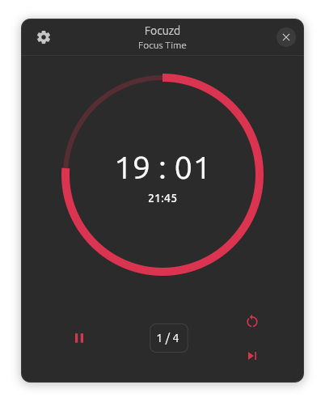

# focuzd

A new pomodoro app, built with Flutter, the goal is to make a feature-equivalent to Pomotroid. Pomotroid uses electron, which makes it pretty heavy, slow to start, and resource intensive. Flutter will solve these issues while also looking nice, and later more features as well as more platforms will be added. 

# Light Mode 

# Dark Mode 

 ### For release 1.0
  - [ ] Feature equivelant to pomotroid
    - [x] start pomodoro sessions
    - [x] show time remaining 
    - [x] show how many sessions you have done in this round 
    - [x] go to the next session
    - [x] reset the session 
    - [x] skip the session
    

    - [x] change the time lentgh of focus time 
    - [x] change the time lentgh of break 
    - [x] change the time lentgh of long break
    - [x] change the number of rounds
   

    
    - [x] have desktop notifications
    - [x] autostart work timer 
    - [x] autostart break timer 
    - [x] memorise the setting's changes
    - [ ] make the window be always on top(opt in) 
    - [ ] reset changes to default
    - [ ] make sounds when changing state(opt-in)  
  
  - [ ] publish to snapstore
    - [x] snap the app(unfortunately in core22 for now)
    - [x] publish the edge-beta (waiting human review)
    - [ ] publish in stable                                                                       
  - [ ] solve the bloc-db problem
  - [x] revamp settings page to be more user-friendly 
  - [x] fix issue, Next() not working properly when not skipping
  

 ### for release 2.0(still thinking)
   - [ ] add statistics and analytics
       

