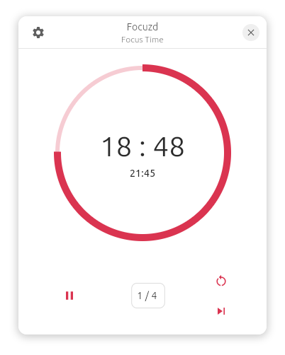
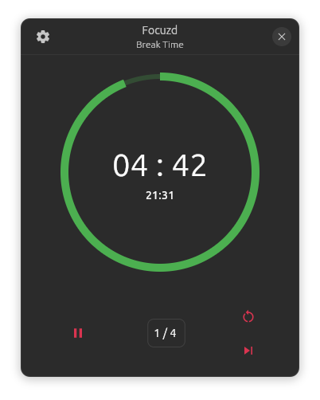

# focuzd

## Dark Mode

## Light Mode

## Break

A new pomodoro app, built with Flutter, the goal is to make a feature-equivalent to Pomotroid. Pomotroid uses electron, which makes it pretty heavy, slow to start, and resource intensive. Flutter will solve these issues while also looking nice, and later more features as well as more platforms will be added.

#### Pomotroid / Focuzd comparison

1. CPU Usage:
   Due to Flutter apps being natively compiled in machine code, the performance of Focuzd
   far exceeds that of Pomotroid, which is based on Electron, so every time you use it,
   it's like opening a chromium tab.
   Testing on my device, with the countdown on, the CPU Usage was the following:

- _Focuzd_: **0.43%**

- _Pomotroid_: **9.59%**

  

2. Download Size (Snap Store Data):

- _Focuzd_: **12.53 MB**

- _Pomotroid_: **67.08 MB**

3. architecture availability

- _focuzd_ : arm64, amd64
- _pomotroid_: amd64 _only_

4. Update Status:
   Pomotroid hasn't seen any update since 9 February of 2021

### for release 2.0(still thinking)

- [ ] Release 2.0 ( changing 1.9 release to 2.0 with extra feature )

  - [x] Should take a large break every 4 sessions not after the last work session
  - [x] add statistics and history base support
  - [x] thus clean and improve the db
  - [x] make the db file app specific, better breaking db compatibility now than later, maybe think of a migration strategy

  - [ ] create the history & statistics page

    - [ ] See total work(focus break) time
    - [ ] See charts for week / month / year
    - [ ] See about each topic \*, and quality view in general(all subjects)

  \*:

  - [ ] Add Subject/topic support

    - [x] Each Subject should have sub-subjects, and super-subjects, ex: School -> Sciences -> Mathematics -> Algrebra & Geometry etc.
    - [x] The working subject should be visible on the main page
    - [x] Subject should be optional, and the UI shouldn't be invasive
    - [ ] Make a subject page, for creating, linking, subjects.

    - [ ] Together with Subjects, Goals should be implemented.
      - [ ] Goals should be **quantity-only** as well as **quantity-quality**, so you have to be able to set a goal of _6 sessions / week_, and a goal of _6 sessions of Mathematics(/Algrebra) / week_. Another idea is having a **quality-relation** type of goal, example: 2 sessions of Mathematics/_Algebra_ / 1 session of Mathematics/_Geometry_, as well as a **quantity-quality-relation**, example 2 sessions of Mathematics/Algebra this.week / 1 session of Mathematics/Algebra last.week, and a **quantity-relation**, example: 2 session this week / 1 session last week.
        > Goals should be well imoplemented for both incremental changes +20% Mathematics this week/month/year
        > But also for decreasing goals -20% Maths, even a decreasing/increasing relational goal, for instance :
        > -20% Maths/Algebra -> +20% Maths/Geometry, this week(s)/month(s)/year(s)
      - [ ] Send notifications when a goal is completed

  (more to come)

  - [ ] migrate snap to core24
